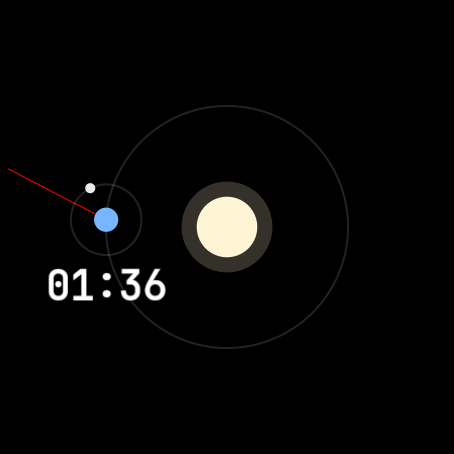

# Orrery Wear OS Watch Face

An astronomical Wear OS watch face showing a real-time mechanical model of the solar system (Sun, Earth, and Moon) built using the modern **Watch Face Format (WFF) version 2**.

---

## 🌌 Visual & Astronomical Mechanics

The watch face renders a real-time orbit system centered on the Sun:
* **The Sun**: Stationary in the center of the watch face.
* **The Earth**: Orbits the Sun once every 365.25 days using the `[DAY_OF_YEAR]` system variable.
* **The Moon**: Orbits the Earth using the system-provided `[MOON_PHASE]` source (0–28 lunar cycle position). At New Moon (0), the Moon sits between Earth and Sun; at Full Moon (14), it's on the opposite side.

### 📍 The Rotating Meridian (Red Line)
To signal your approximate location on Earth (local meridian/timezone) relative to the Sun, a red pointer line starts at the Earth's surface and extends all the way to the circular edge of the screen.

The line is rotated dynamically based on both the Earth's orbital position and the time of day:
$$\text{Rotation Angle} = \text{[DAY\\_OF\\_YEAR]} \times 0.9863^\circ + \text{[HOUR\\_0\\_23]} \times 15^\circ + \text{[MINUTE]} \times 0.25^\circ + 90^\circ$$

* **Orbital Angle (`[DAY_OF_YEAR] * 0.9863`)**: Offsets the rotation so the zero-point is relative to where the Earth currently resides in its 365-day orbit.
* **Rotation Rate (`15°/hour` & `0.25°/minute`)**: Represents the Earth's $360^\circ$ rotation on its axis over 24 hours.
* **Coordinate Offset (`+ 90`)**: Corrects the offset between standard Cartesian math coordinates ($0^\circ$ is right) and Watch Face Format coordinates ($0^\circ$ is top).

#### Visual Outcomes:
* **At 12:00 PM (Noon)**: The red line points directly at the Sun.
* **At 12:00 AM (Midnight)**: The red line points directly away from the Sun (into the night side).
* **At 6:00 AM / 6:00 PM**: The red line is at $90^\circ$ angles relative to the Sun (representing sunrise and sunset).

---

## ✍️ Custom Fonts
The watch face uses **JetBrains Mono** for the digital clock rendering:
* Font file: [jetbrains_mono.ttf](file:///Users/arthurs/workspace/agy-workspace/orrery-watchface/app/src/main/res/font/jetbrains_mono.ttf)
* Declared in [watchface.xml](file:///Users/arthurs/workspace/agy-workspace/orrery-watchface/app/src/main/res/raw/watchface.xml) using ``.
