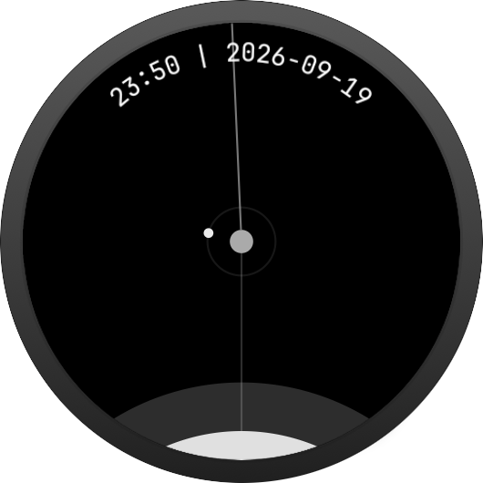

# Orrery Wear OS Watch Face

An astronomical Wear OS watch face showing a real-time geocentric model of the Earth, Moon, and Sun, built using the modern **Watch Face Format (WFF) version 4**.

---

## 🌌 Visual & Astronomical Mechanics

The watch face renders a real-time system centered on the Earth:
* **The Earth**: Stationary in the exact center of the watch face.
* **The Sun**: A massive celestial body whose top edge glows from the bottom of the screen.
* **The Moon**: Orbits the Earth using the system-provided `[MOON_PHASE_POSITION]` source (0–28 lunar cycle position). At New Moon (phase 0), the Moon sits perfectly at the bottom between the Earth and the Sun; at Full Moon (phase 14), it sits at the top on the opposite side.

### 📍 The Rotating Meridian (Pointer Line)
To signal your approximate location on Earth (local meridian/timezone) relative to the Sun, a pointer line starts at the Earth's center and extends all the way to the circular edge of the screen.

Because the Sun is fixed at the bottom (representing Solar Noon), the meridian line functions as a standard 24-hour clock hand:
$$\text{Rotation Angle} = \text{[HOUR\\_0\\_23]} \times 15^\circ + \text{[MINUTE]} \times 0.25^\circ$$

* **Rotation Rate (`15°/hour` & `0.25°/minute`)**: Represents the Earth's $360^\circ$ rotation on its axis over 24 hours.

#### Visual Outcomes:
* **At 12:00 PM (Noon)**: The line points straight down, directly at the Sun.
* **At 12:00 AM (Midnight)**: The line points straight up, directly away from the Sun (into the night side).
* **At 6:00 AM / 6:00 PM**: The line points horizontally to the left or right (representing sunrise and sunset).

---

## 🎨 Color Profiles
The watch face supports multiple color themes via the customization menu (long-press the watch face to configure):
* **Earth**: A vibrant palette featuring a blue Earth, bright sun, and a red meridian line.
* **Monochrome**: A clean, grayscale aesthetic with varying shades of gray for different celestial bodies.

---

## ✍️ Custom Fonts
The watch face uses **JetBrains Mono** for the digital clock rendering:
* Font file: `app/src/main/res/font/jetbrains_mono.ttf`
* Declared in `watchface.xml` using ``.